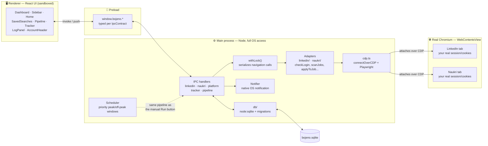
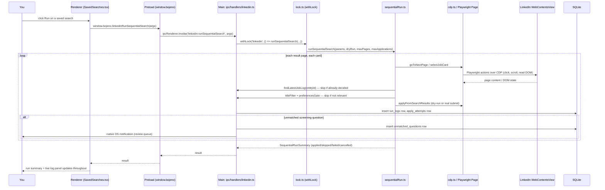

# ⍢ Bojeno

Local-first job-search automation desktop app. It drives your own logged-in LinkedIn/Naukri session inside a real, visible browser view — scans postings, fills Easy Apply forms, and tracks the whole interview funnel in a local SQLite database — so applying to relevant jobs costs you attention only when it actually needs a decision.

Not an "auto-apply to 1000 jobs" spam bot: targeted, relevant applications only, entirely visible in the UI and the logs. See [`bojeno-project-brief.md`](./bojeno-project-brief.md) for the full vision/decisions doc (the source of truth this README summarizes) and [`CONTRIBUTING.md`](./CONTRIBUTING.md) for the git/issue workflow.

## Contents

- [How it works, in one picture](#how-it-works-in-one-picture)
- [Why Electron + CDP + Playwright](#why-electron--cdp--playwright)
- [Project structure](#project-structure)
- [Data flow: what happens when you click "Run"](#data-flow-what-happens-when-you-click-run)
- [Core concepts](#core-concepts)
- [Database schema](#database-schema)
- [Feature inventory](#feature-inventory)
- [The UI](#the-ui)
- [Getting started](#getting-started)
- [Development notes](#development-notes)

## How it works, in one picture



The two `WebContentsView`s on the right are the **real browser** — your real LinkedIn/Naukri session, cookies and all, visible in the app's own window at all times. Nothing runs in a hidden headless browser: Playwright attaches to the *same* view you're looking at over Chrome DevTools Protocol, so a scan or an apply-run is just the app moving the mouse/keyboard the way you would, on the tab you can already see.

## Why Electron + CDP + Playwright

| Decision | Why |
|---|---|
| `WebContentsView` (not `BrowserView`, deprecated) for each platform | Gives free tab UX and, via `persist:<platform>-<instanceId>` partitions, per-platform cookie isolation — LinkedIn and Naukri sessions never bleed into each other. |
| Playwright via `chromium.connectOverCDP()`, not a hidden headless browser | Reuses proven automation logic (selector strategies, shadow-DOM handling, retries, human-like pacing) against the *same visible session* the user already has open — nothing hidden, nothing double-logged-in. The CDP endpoint also exposes the app's own Electron renderer as a target, so every lookup selects its page explicitly by URL substring (`findPageByUrlPart`) rather than assuming index 0. |
| `node:sqlite` (`DatabaseSync`), not `better-sqlite3` | Ships inside Electron's bundled Node with zero native compilation — `better-sqlite3` needed a prebuilt binary that didn't exist for this Electron/Node combination, and installing a C++ toolchain to build one was rejected. Tradeoff: still marked experimental in Node. |
| Root-URL redirect for login checks, not deep-link + inverse condition | Navigate to `linkedin.com` / `naukri.com` and watch where it lands (`waitForPathname`) — the same thing a real user's browser does, and far less brittle than inferring auth state from a gated page's DOM. |
| Timestamp-prefixed SQL migrations + `applied_migrations` table | Sequential integers collide when two branches add a migration independently; a timestamp never does. A full DB file backup is taken before every migration runs. |
| One shared `shared/ipc-contract.ts`, imported by main *and* renderer | The renderer never calls `ipcRenderer.invoke` directly — `preload/index.ts` exposes one `window.bojeno.*` method per channel, typed against the same `IpcContract` interface the main-process handler implements, so a payload-shape mismatch is a compile error, not a runtime surprise. |
| `withLock(platform, fn)` around every adapter action that navigates | Two concurrent calls against the same `WebContentsView`'s navigation race each other into `net::ERR_ABORTED` (this is exactly what React StrictMode's dev-mode double-invoke exposed for `checkLogin`, and what a real double-click on a fetch button would trigger too). The lock is a cheap per-id promise chain. |

## Project structure

```
src/
  main/                            # Node-side, full OS access
    index.ts                       # app bootstrap: single-instance lock, CDP setup, DB, IPC handlers, window
    window.ts                      # BrowserWindow + the two WebContentsViews, tab/pane layout math
    cdp.ts                         # connectOverCDP, findPageByUrlPart, waitForPathname, gotoWithRetry
    lock.ts                        # withLock() — per-id serialization for navigation-driving IPC calls
    instance.ts                    # instanceId — scopes session partitions/userData per worktree
    appSession.ts                  # in-memory app-session state (active runs, etc.)
    adapters/
      linkedin/
        adapter.ts                 # checkLogin, appliedCount, recentAppliedJobs, captureJobDetails, scanJobs, applyToJob
        selectors.ts               # every LinkedIn selector/URL, centralized — never inline in adapter logic
        scan.ts                    # job-card DOM leaf-walk → parseCardFromLeaves
        apply.ts                   # Easy Apply modal step-through (stepThroughEasyApplyModal)
        applyRules.ts              # regex-to-answer-field rules against the AnswerBank
        titleFilter.ts             # positive/negative keyword relevance gate on card titles
        preferencesGate.ts         # applicant-count / years-required / fit-tier skip rules
        sequentialRun.ts           # walks a whole search's result list: select card → JD → apply → advance
        searchPaneApply.ts         # apply flow driven from the in-place results detail pane
        jobDetails.ts              # plain-text JD parsing (fit tier, applicant counts, years, emails/phones)
        jobPoster.ts               # "Meet the hiring team" block parsing
        company.ts                 # name → LinkedIn company id resolver (for f_C company-scoped search)
        geoIds.ts                  # place-name → LinkedIn geoId table
        loginStatusCache.ts        # short-lived login-status memoization
        relativeTime.ts            # "3 hours ago" style text → Date
      naukri/
        adapter.ts                 # checkLogin (parity buildout in progress)
        selectors.ts
    config/
      answerBank.ts                # AnswerBank shape; real values in gitignored .local/easy-apply-answers.json
      preferences.ts                # JobFilterPreferences shape; real values in gitignored .local/preferences.json
    db/
      index.ts                     # getDb() — node:sqlite connection, runs pending migrations on startup
      migrate.ts                   # migration runner: applied_migrations table + timestamped file backup
      migrations/*.sql              # timestamp-prefixed, one file per schema change
      queries/                      # one file per table/domain (see Database schema below)
    ipc/
      channels.ts, handlers/        # linkedin.ts, naukri.ts, platform.ts, tracker.ts, pipeline.ts
    scheduler/
      priorityWindow.ts             # isDue/isPeakWindow — peak vs off-peak check interval
      scheduler.ts                  # generic tick()/start()/stop(), deps injected for testability
      runScheduler.ts               # wires the scheduler to the real DB + the manual-run pipeline
    notifications/
      unmatchedQuestionNotifier.ts  # native OS notification on a new review-queue item
  preload/
    index.ts                        # contextBridge: window.bojeno.* typed per IpcContract
  renderer/src/
    components/
      Dashboard/                    # top-level shell: sidebar + active view + status bar + log panel
      Home/                         # review queue: unmatched questions, follow-ups due
      LinkedIn/                     # AccountHeader (login/applied-count/rate), SavedSearches (matrix CRUD)
      Pipeline/                     # manual funnel CRM: contacted → interview → outcome
      Tracker/                      # applied-count-over-time chart + run-log table
      LogPanel/                     # live-tailed run_logs feed along the bottom
      UrlBar/                       # read-only address bar for whichever platform tab is active
      Sidebar/                      # icon rail: Home / Pipeline / LinkedIn / Naukri
      ui/                           # shadcn primitives (button, card, badge, input, separator)
  shared/
    ipc-contract.ts                 # IpcChannels + IpcContract — the one typed source of truth for all IPC
    types.ts                        # domain types: Platform, RunLog, ApplyResult, JobDetails, ...
scripts/                            # devcheck.cjs, dev-restart.cjs, seed-search-matrix.cjs, one-off import scripts
migration-backups/                  # timestamped .sqlite copies, gitignored
```

## Data flow: what happens when you click "Run"



## Core concepts

**Adapter** — a plain (not capability/kind-based) module per platform exposing `checkLogin`, `appliedCount`, and platform-specific actions like `scanJobs`/`applyToJob`. Both LinkedIn and Naukri are the same shape today (a view + a login gate + CDP), so there's deliberately no registry abstraction — one gets added only if a structurally different adapter (e.g. an API-only ATS source with no browser view) is actually built.

**Run mode** — every action-triggering IPC call takes an optional `RunMode` (`'read-only' | 'dry-run' | 'live'`, defaulting to `'live'`) plus, for apply actions, its own `dryRun` boolean. `dry-run` walks the whole flow — including filling in Easy Apply fields — without ever clicking Submit; `read-only` skips writes entirely. This is the main iteration tool for tuning filters/selectors without spending real applications.

**Login gating** — every session-based adapter action is preceded by a live DOM check (`checkLogin`), never a cached assumption. A logged-out session produces an explicit `auth_required` outcome in `run_logs` and a "Log in now" banner in `AccountHeader`, instead of a buried failure deep in a scan.

**Title filter + preferences gate** — before ever opening a posting, a card's title is checked against a positive/negative keyword filter (`titleFilter.ts`), and after its JD is captured, it's checked against applicant-count / years-required / fit-tier thresholds (`preferencesGate.ts`) — both configured in `.local/preferences.json`, never hardcoded. A posting failing either check is logged as `skipped` with the specific reason, not silently dropped.

**Job-id dedup cache** — `findLatestJobLog` checks `run_logs` for any prior decision on a job id before ever opening its posting again. The saved-search matrix (nine keyword × location combinations) deliberately overlaps in results; this is what keeps overlapping searches from re-evaluating (or re-applying to) the same job.

**Answer bank** — the owner's personal form-fill data (`AnswerBank`: name, contact info, CTC, notice period, resume path, etc.) lives in a single gitignored `.local/easy-apply-answers.json`, never in code or the repo; `easy-apply-answers.example.json` is the tracked template. `applyRules.ts` maps each Easy Apply modal question (by regex) to one of these fields. A question no rule matches is filled with a throwaway placeholder (never submitted) and queued to the review queue as an `unmatched_questions` row.

**Review queue, not real-time alerts** — anything needing a human decision (an unmatched screening question today; a login expiry or budget hit are the same shape later) is written to a DB table and fires one native OS notification. Nothing blocks waiting for you — you clear the queue in a batch whenever convenient, and a run that hits one just logs it and keeps going.

**Apply-rate ledger** — `getApplyRateLedger` computes real (non-dry-run, actually-submitted) applies per platform over the last hour/24h from `apply_attempts`, shown in `AccountHeader`. Logging/visibility only today — nothing caps or auto-pauses a run based on it yet (see the brief §5).

**Priority-window scheduler** — `scheduler.ts` + `priorityWindow.ts` implement a peak/off-peak ticker (roughly hourly during 9–11am/2–5pm, every 3h otherwise) that calls the *exact same* run-pipeline function the manual Run button uses, guarded by the same in-flight lock. It's fully built and unit-tested but currently left uncalled in `main/index.ts` (commented out) while a manually-supervised, page-capped live-apply campaign is underway — flip it back on once that settles.

**Instance scoping** — `instanceId` (from `BOJENO_INSTANCE_ID`, default `'default'`) namespaces the SQLite file, `userData` path, and each platform's session partition, so that if/when parallel git worktrees each run their own live Electron instance, they never share cookies or a database file.

## Database schema

Single SQLite file (`node:sqlite`, WAL mode), timestamp-prefixed migrations under `src/main/db/migrations/`, tracked in an `applied_migrations` table, with a full timestamped file-copy backup taken before every migration runs.

| Table | Purpose |
|---|---|
| `run_logs` | One row per scan/apply/check action: `run_id, timestamp, script, outcome, entity_type, entity_id, job_title, company, location, detail (JSON), run_mode`. `outcome` is an enum: `success \| failed \| auth_required \| rate_limited \| awaiting_input \| skipped`. Indexed on `(entity_type, entity_id)` for the dedup-cache lookup. |
| `applied_counts` | One row per fetch of the platform's own "applied" counter — `platform, metric, count, fetched_at` — feeds the Tracker chart. |
| `applied_jobs` | LinkedIn-scraped recent-applications rows (title, company, location, applied timestamp) — also the target of the historical data-export backfill. |
| `apply_attempts` | One row per `applyToJob` attempt: `platform, external_job_id, outcome, reason, header, dry_run, attempted_at` — source of the apply-rate ledger. |
| `company_blacklist` | Company names/reasons the apply flow refuses to attempt against — checked before every apply. |
| `companies` | One row per company, merged from two independent, non-overwriting sources: a live LinkedIn `/about` scrape and a one-time GCC company-research import (hq country, India offices, careers URL, ATS, status). |
| `job_snapshots` | Captured `JobDetails` (JD text, fit tier, applicant counts, job poster, contact emails/phones) per job. |
| `unmatched_questions` | The review queue: one row per Easy Apply question no rule matched — `platform, external_job_id, question_kind, question_label, resolved, answer, notified_at`. |
| `linkedin_saved_searches` | The search matrix: `name, keywords, location, geo_id, distance_km, sort_by_recent, easy_apply_only, date_posted, workplace_types, last_run_at`. |
| `pipeline_contacts` | Manually-logged funnel stages 3–5: `platform, company, external_job_id, contacted_at, contact_note, interview_scheduled_at, last_follow_up_at, status`. Drives the follow-up-due reminders on Home. |

## Feature inventory

**LinkedIn (built):**
- Login check (root-URL redirect) and applied-count fetch
- Recent-applied-jobs scrape (last 24h, paginated)
- Job-detail capture: JD text, fit tier, applicant counts (top-card + premium widget), years-required, contact emails/phones, "Meet the hiring team" poster info
- Job-card scan (Easy Apply badge, already-applied badge, posted-time) over a search's result list
- Company-name → LinkedIn company id resolution, for `f_C`-scoped company searches
- Easy Apply modal fill: dry-run or live submit, answer-bank-driven, unmatched questions queued for review
- Sequential search runner: walks an entire saved search's result pages one card at a time — title filter → dedup-cache check → JD capture → preferences gate → apply/skip — with a configurable page cap and a real-application cap (`maxApplications`), cancellable mid-run
- Saved-search matrix: N locations × M keyword variants stored as one CRUD list, each independently runnable/stoppable, with `lastRunAt` for scheduler rotation
- Human-like pacing (randomized multi-second gaps between page-level actions) instead of a fixed interval

**Naukri (built):** login check, applied-count fetch. Apply-flow parity with LinkedIn is the next planned milestone for this platform.

**Cross-cutting:**
- Review queue + native OS notification for unmatched screening questions, with de-duplication against an already-notified unresolved question
- Pipeline/funnel tracking: manually log contacted / interview-scheduled / outcome per company, with a follow-ups-due list surfaced on Home
- Apply-rate readout (last-hour / last-24h real applies) per platform, visibility-only
- Priority-window scheduler (built, currently disabled — see [Core concepts](#core-concepts))
- Live-tailed run-log panel and applied-count-over-time chart in the Tracker view

**Deferred / explicitly not built** (see the brief §11/§13 for the reasoning): a second full ATS-adapter kind (Lever/Ashby/Greenhouse), a rate-limit enforcement cap (only a visibility ledger exists), a circuit breaker / auto-disable-on-failure, canonical cross-platform job/company dedup tables, LLM-assisted filtering, and packaging (`electron-builder`) — this is a laptop-only, `npm run dev` tool until the core journey is fully proven.

## The UI

The window is a fixed two-pane layout: a 64px icon rail on the far left, then either a full-width app view (Home/Pipeline) or, for a platform tab, a saved-searches panel plus the real browser view filling the rest of the window, with a status bar above and a live log panel along the bottom.

- **Sidebar** — Home (⌂), Pipeline (☎), LinkedIn, Naukri (currently disabled pending apply-flow parity).
- **Home** — the review queue: unresolved unmatched questions (answer inline to resolve) and pipeline follow-ups that are due.
- **LinkedIn tab** — `AccountHeader` (login banner / "Log in now", applied count, apply-rate) above the real LinkedIn `WebContentsView`; `SavedSearches` panel alongside it lists the search matrix with Run/Stop per entry.
- **Pipeline** — a table of manually-logged contacts (company, status, contacted/interview dates, notes) with create/update/delete.
- **Tracker** (reachable from the log panel / dashboard) — the applied-count-over-time chart and a scrollable, filterable run-log table — the same rows the live log panel tails.
- **LogPanel** — a bottom strip that live-tails `run_logs` as any run (manual or scheduled) produces them, so nothing a run does is ever invisible even mid-run.
- **UrlBar** — read-only, shows the active platform tab's current URL, mirrored from `platform:activeTabUrlChanged` pushes.

Built with React 19, Tailwind v4, and shadcn/ui primitives (`button`, `card`, `badge`, `input`, `separator` today).

## Getting started

### Install

```bash
npm install
```

### Configure your personal data (not committed)

```bash
cp easy-apply-answers.example.json .local/easy-apply-answers.json
cp preferences.example.json .local/preferences.json
```

Fill in your real name/contact/CTC/resume-path details and your filter thresholds — both files under `.local/` are gitignored and never leave your machine.

### Run it

```bash
npm run dev
```

This kills any stray `electron`/`electron-vite` process first (so a leftover window from an unclean previous session doesn't silently run a second instance against the same database), then launches with hot reload for the renderer and auto-restart for main/preload. On first launch, click the LinkedIn tab and log in — your session lives in that tab's own Chromium partition, nothing is ever typed into it by the app.

### Checks

```bash
npm run check      # typecheck + lint + test — also what pre-commit runs
```

### Build

```bash
npm run build
```

Packaging (`electron-builder`) is intentionally deferred — see the project brief.

## Development notes

- **`npm run devcheck -- "<expression>"`** evaluates arbitrary JS (including any `window.bojeno.*` call) against the running app's renderer over CDP — the fast way to verify a change against the real app instead of hand-writing a throwaway script.
- A pre-commit hook runs `npm run check`; a commit-msg hook enforces `<type>(<scope>): #<issue> <summary>` (see [`CONTRIBUTING.md`](./CONTRIBUTING.md)).
- Selectors live only in each adapter's `selectors.ts` — LinkedIn ships hashed/obfuscated class names throughout, so a selector is always inspected live against the real logged-in page before being written, never guessed from a screenshot.
- Full architecture rationale, the funnel model, and the current priority list are kept up to date in [`bojeno-project-brief.md`](./bojeno-project-brief.md) — read it before making a structural change.
